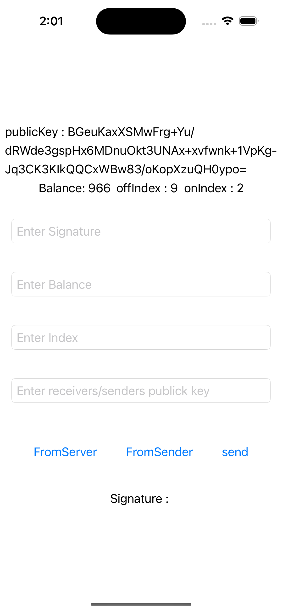

 **Here's the complete README file, incorporating all information and addressing potential redundancies:**

# Offline Payment Transaction iOS App

**Overview**

This iOS Xcode project demonstrates a secure method for conducting offline payment transactions between users. It utilizes encryption and Apple's Secure Enclave to protect sensitive data, enabling transactions even without a constant internet connection.

**Key Features**

* Offline transaction processing
* Secure storage of balance and index data using the Secure Enclave
* Encryption with elliptic curve keys
* Digital signature verification
* Offline balance download and verification
* Offline balance transfer

**Getting Started**

1. **Clone the project:**

   ```bash
   git clone https://github.com/AVSaiKumar/OfflineXcode.git
   ```

2. **Open the project in Xcode:**

   - Open the `OfflineService.xcodeproj` file.

3. **Run the project:**

   - Click the "Run" button to launch the simulator.


**4. Understanding the UI Screen**  
   
- 


The user interface displays key information about your wallet and transactions:

- Public Key: This is your wallet's unique identifier, used for secure transactions.
- Balance: This reflects your current available funds, updating as you send and receive payments.
- OnIndex (Online Index): This number increases each time you successfully add a token from the central server. It helps prevent replay attacks, ensuring transactions aren't duplicated.
- OffIndex (Offline Index): This number increases when you send tokens to others or receive and verify tokens offline. It similarly protects against replay attacks during offline transactions.

Key Points:

   - Both OnIndex and OffIndex play crucial roles in transaction security.
   - Their increments safeguard against unauthorized transaction duplication.
   - Copy public key from debug area: The public key will be printed in the debug area of Xcode. Copy it from there, as copying from the simulator can be difficult.


**Key Functionalities**

 **.Online Balance to Offline Balance:**

- **(Optional) Create a new central bank key:**
   - Run `python3 generate_keys.py` to create new bank keys.
   - Replace the contents of `public_key.pem` in `ContentView.swift` in the variable "publicKeyString" with the newly generated public key.
- **Generate a token:**
   - Run the `sign.py` Python file.
   - Enter the Index value one greater than the one displayed on the UI. For example, if the UI shows "5", enter "6".
   - This creates a token for the user on the central bank (Benhlaf or your newly created one).
   - copy this signature.
   
  -**- Add offline balance:**
   - **Paste the signature** generated by `sign.py` into the signature field on the UI.
   - **Enter the same Index value and amount** used when creating the token.
   - **Press the "FromServer" button.**
   - The app verifies the signature using the central bank's public key.
   - If successful, the **balance and onIndex are incremented** securely in the Secure Enclave.
Note - Here manually we are pasting but actually these communication happens through internet https protocol web
-**- Replay attack prevention:**

- **Index mismatch protection:** The app prevents duplicate transactions using the same token. If you attempt to add the same token again, it will fail with an "index mismatch" status, indicating that the index value has already been used.
- **Signature verification:** If you try to modify the index value to a higher one for the same token, it will result in a signature error. This is because the signature was generated specifically for the original index value, ensuring the integrity of transactions.

-**Key takeaways:**

- These measures effectively safeguard against replay attacks, ensuring that transactions cannot be fraudulently duplicated.
- The use of indexes and signature verification strengthens the security of offline transactions.


**Offline to Offline Balance Transfer:**

- Users send a specified balance to another user's public key with a requested index.
- The sender generates a digital token containing the sender's public key, amount, and index using cryptographic signatures.
- The receiver verifies the token against the sender's public key and increments the balance securely in the Secure Enclave.

**Usage Instructions**

- **View current balance:** The current balance is displayed on the main screen.
- **Send a payment:**
   - Enter the amount to send.
   - Enter the recipient's public key (copied from the debug area or generated using `generate_keys.py`).
   - Tap the "Send" button.
- **Receive a payment:**
   - Enter the sender's signature, amount, and index.
   - Tap the "Verify and Increment Counter" button.

**Additional Information**

- **Key management:**
   - The application generates a private key during its first run and stores it securely in the Secure Enclave.
   - The public key is displayed in the user interface and used in transactions.
- **Debugging and key management:**
   - Copy the public key from the debug area in Xcode.
   - Optional bank keys are provided (`private_key.pem` and `public_key.pem`).
   - Generate new keys using `python3 generate_keys.py`.
   - paste this 
   - Create a token for the user on the Benhlaf central bank using `python3 sign.py`.
- **Signature generation and verification:**
   - The project includes Python scripts for signature creation and verification (`signature_script.py`).
   - Ensure you have the required Python package: `pip install cryptography`
- **Security considerations:**
   - Private keys are securely stored in the Secure Enclave.
   - All sensitive data is encrypted and decrypted using cryptographic methods.
   - Signature verification prevents unauthorized balance modifications.

**For further assistance or inquiries, please refer to the project's GitHub repository or contact the developer.**
